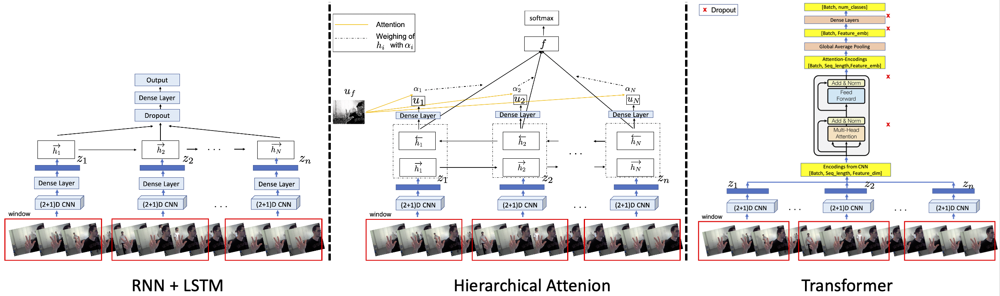

## Important Links

Final report : https://www.overleaf.com/6197336126ccwcbqmdjsdj

## How to Reproduce our Results?

0. Make sure TensorFlow 1.15 version is installed
1. For running the model with (2+1)D-CNN + RNN - our best model run
```
python training_3DCNN_simpleRNN_cluster.py
```
2. For running the model with transformer run
```
python  transformer/training_transformer_cluster.py
```
3. For running the model with attention run
```
python  han/training_attention_han_cluster.py
```

## How to run the first model with 3D-convolutions instead of (2+1)D-convolutions?
```
In the scripts model_3DCNN_simpleRNN_cluster.py and config_3DCNN_simpleRNN_cluster.py
make the suggested changes to run the model with 3D-convolution, where suggested by the comments. 
```

## How to Train (2+1)D-CNN or 3DCNN with Dataset Downloader

1. Set the following parameters in `config_3DCNN_local.py`
	1. `config['json_dir']` should be defined as the path to the .json file for the training set of Sports1M
	2. `config['data_directory']` should be a path to an empty directory where all the training data will be stored
	3. `config['3DCNN']['num_class_labels'] = 487` since there are 487 classes in the Sports1M dataset
	4. `config['num_videos']` This value changes how many videos will be downloaded in each batch of downloads. The larger the value, the larger the available disk space is necessary.
	5. `config['evaluate_every_step']` set it to be a larger number, otherwise it will be evaluating all the time.

2. Run `trainer...._downloader.py`. This will do the following things:
	* It will download and store the validation set and store it in the data_directory. If it finds the file is already there, this is skipped
	* It will start training for the specified number of epochs.

